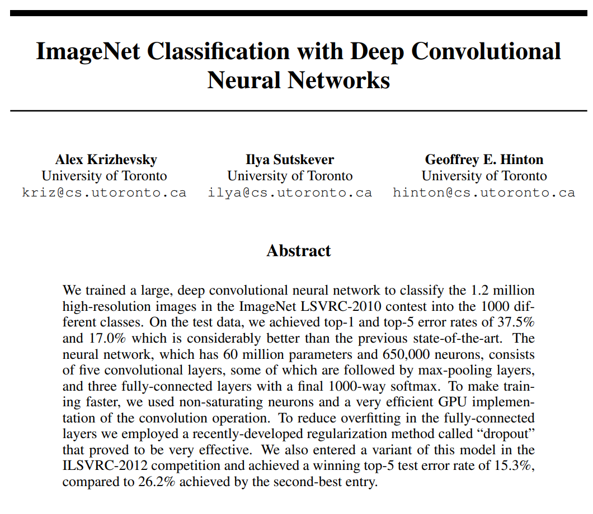

# Paper Reading Inventory

| 日期 | 标题 | 封面 | 内容 | 备注 |
| --: | -- | -- | --: | -- |
| 23/12/2| [AlexNet](papers/NIPS-2012-imagenet-classification-with-deep-convolutional-neural-networks-Paper.pdf) |  | 深度学习CV奠基之作 | 什么是Pooling; ReLU-Nair and Hinton论文可读 |